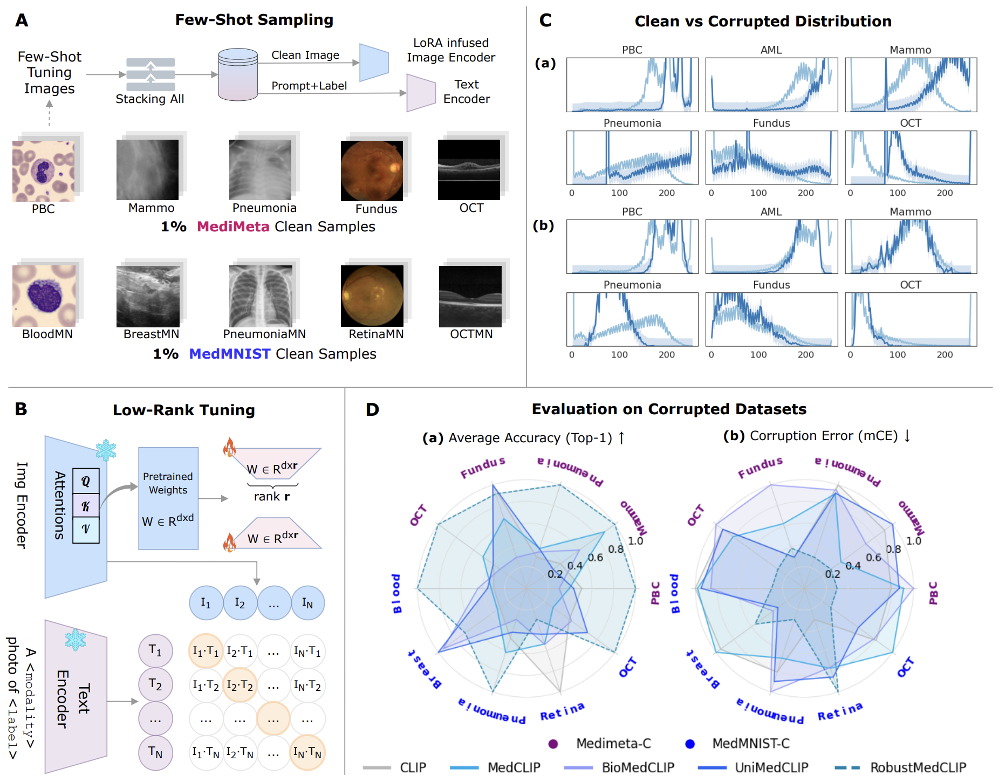

# RobustMedCLIP: On the Robustness of Medical Vision-Language Models: Are they Truly Generalizable?

> **Accepted at [Medical Image Understanding and Analysis (MIUA) 2025]**

[](LICENSE)
[](https://arxiv.org/abs/2505.15425)
[](https://huggingface.co/datasets/razaimam45/MediMeta-C)
[](https://huggingface.co/razaimam45/RobustMedCLIP)
[](https://github.com/BioMedIA-MBZUAI/RobustMedCLIP)

---

## 🚀 Highlights

- 🧠 **MVLM Benchmarking**: Evaluate 5 major and recent MVLMs across **5 modalities**, **7 corruption types**, and **5 severity levels**
- 📉 **Corruption Evaluation**: Analyze degradation under Gaussian noise, motion blur, pixelation, etc.
- 🔬 **MediMeta-C**: A new benchmark simulating real-world OOD shifts in high-res medical images
- 🧪 **Few-shot Robustness**: **RobustMedCLIP** uses just 1-10% of clean data for adaptation
- 🧠 **LoRA Efficient Tuning**: Low-rank fine-tuning in transformer attention layers

<p align="center">
  
</p>
<p align="center">
  Overview of the RobustMedCLIP pipeline: A) Few-shot Sampling of Clean Samples from MediMeta and MedMNIST across 5 modalities; B) Fine-tuning LoRA adapters using Few-shot samples; C) Distribution Shifts of MediMeta-C compared to Clean samples; D) Evaluation Results across Top-1 Accuracy and Corruption Error for 4 baselines and RobustMedCLIP.
</p>

---

## 📦 Installation

```bash
git clone https://github.com/BioMedIA-MBZUAI/RobustMedCLIP.git
cd RobustMedCLIP
conda create -n robustmedclip python=3.12.7
conda activate robustmedclip
pip install -r requirements.txt
pip install hugginface_hub
````

You will also need `<YOUR-HUGGINGFACE-TOKEN>` with your personal Hugging Face access token, to directly download Datasets and Model Weights.\
To create an access token, go to your Huggingface `Settings`, then click on the `Access Tokens` tab. Click on the New token button to create a new User Access Token.

---

## 🧠 Models

All baseline and RobustMedCLIP model checkpoints are available for direct download via Hugging Face at [RobustMedCLIP](https://huggingface.co/razaimam45/RobustMedCLIP/tree/main):

```bash
huggingface-cli download razaimam45/RobustMedCLIP \
  --local-dir ./outputs \
  --repo-type model \
  --token <YOUR-HUGGINGFACE-TOKEN>
```

📁 `Outputs` Folder Structure: The `outputs/` folder (should be in root folder) contains all trained model weights and evaluation results:

```bash
outputs/
├── checkpoints/       # Baseline MVLMs (MedCLIP, UniMedCLIP)
├── exp-rank-8/        # RobustMedCLIP (LoRA Rank = 8) for ViT and ResNet across few-shots (1/3/7/10)%
├── exp-rank-16/       # RobustMedCLIP (LoRA Rank = 16) for ViT and ResNet across few-shots (1/3/7/10)%
└── results/           # Evaluation logs across mCE/Accuracy metrics
```

---

## 🧬 Datasets

This project proposes MediMeta-C as corruption benchmark; and evaluates MVLMs on MedMNIST-C and MediMeta-C benchmarks.

| Dataset        | Modality         | Clean Samples | Corruption Sets | Resolution |
|----------------|------------------|----------------|------------------|-------------|
| **MediMeta-C** | Multi-modality   | 5 Modalities   | 7 corruptions × 5 levels | High-res |
| **MedMNIST-C** | Public Benchmark | 5 Modalities   | 7 corruptions × 5 levels | Low-res  |

### 📂 Dataset Structure

The MediMeta-C dataset is hosted on HuggingFace and organized as follows:

```bash
MediMeta-C/
├── pbc/                  # Blood Cell modality
│   ├── test/             # Test set
│   │   ├── clean.npz     # Clean samples
│   │   ├── brightness_severity_1.npz
│   │   ├── brightness_severity_2.npz
│   │   ├── ...           # Other severity levels
│   │   └── brightness_severity_5.npz
│   ├── val/              # Validation set
│       ├── clean.npz
│       ├── contrast_severity_1.npz
│       ├── contrast_severity_2.npz
│       ├── ...           # Other severity levels
│       └── contrast_severity_5.npz
├── fundus/               # Fundus modality
│   ├── test/
│   ├── val/
│   └── ...               # Similar structure as above
├── ...                   # Other modalities
└── README.md             # Dataset description
```

You can download the dataset from: [MediMeta-C](https://huggingface.co/datasets/razaimam45/MediMeta-C/tree/main), and [MedMNIST-C](https://github.com/francescodisalvo05/medmnistc-api). The downloaded folder `data/MediMeta-C` should be in the root of the project folder.

```bash
huggingface-cli download razaimam45/MediMeta-C --local-dir ./data/MediMeta-C --repo-type dataset --token <YOUR-HUGGINGFACE-TOKEN>
````

---

## 🔧 Usage

### 1. Few-Shot Tuning

You can fine-tune RobustMedCLIP with either ViT or ResNet backbones:

```bash
# Fine-tune with ViT backbone (e.g., BioMedCLIP)
bash scripts/run_finetune_vit.sh

# Fine-tune with ResNet backbone (e.g., MedCLIP)
bash scripts/run_finetune_resnet.sh
```

### 2. Evaluation

Evaluate a fine-tuned or pretrained MVLM (including RMedCLIP):

```bash
# Evaluation for RobustMedCLIP (RMC)
bash scripts/run_eval_rmed.sh

# Custom evaluation on other models (rmedclip, biomedclip, unimedclip, medclip, clip) 
python evaluate.py --model rmedclip \
                   --backbone vit \
                   --gpu 0 --corruptions all --collection medimeta 
```

---

## 📊 Results

RobustMedCLIP consistently outperforms prior MVLMs under corruptions across all modalities:

| Model        | Clean Error ↓ | mCE ↓ (avg) |
| ------------ | ------------- | ----------- |
| CLIP         | 100.0         | 100.0       |
| MedCLIP      | 106.4         | 112.5       |
| BioMedCLIP   | 116.3         | 126.8       |
| UniMedCLIP   | 111.8         | 98.87       |
| **RMedCLIP** | **62.8**      | **81.0**    |

Detailed benchmarks available in `Results and Discussions`.

---

## ✏️ Citation

If you find this repository helpful, please cite our paper:

```bibtex
@misc{imam2025robustnessmedicalvisionlanguagemodels,
      title={On the Robustness of Medical Vision-Language Models: Are they Truly Generalizable?}, 
      author={Raza Imam and Rufael Marew and Mohammad Yaqub},
      year={2025},
      eprint={2505.15425},
      archivePrefix={arXiv},
      primaryClass={cs.CV},
      url={https://arxiv.org/abs/2505.15425}, 
}
```

---

## 🤝 Acknowledgements

* Built on top of [BioMedCLIP](https://arxiv.org/abs/2303.00915) and [MedCLIP](https://arxiv.org/abs/2210.10163)
* MediMeta-C corruption designs are inspired by [ImageNet-C](https://arxiv.org/abs/1903.12261) and [MedMNIST-C](https://arxiv.org/abs/2406.17536)

For questions, contact: **[raza.imam@mbzuai.ac.ae](mailto:raza.imam@mbzuai.ac.ae)**

